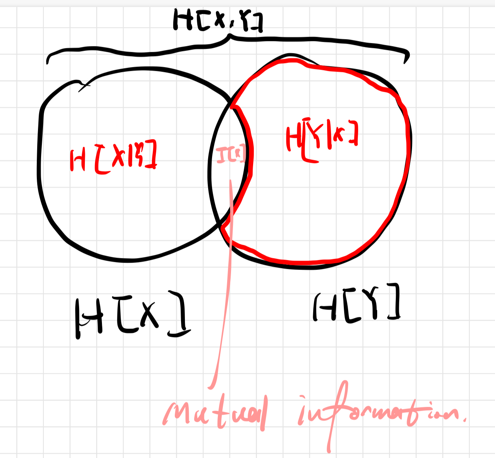

# 信息论

## 第一章 绪论

&emsp;&emsp;本课程是中国科学院大学人工智能学院开设的专业选修课，使用的教材是 Thomas M.Cove 所著的《信息论基础》，要求的前序课程为**概率与统计**，**微积分**与**线性代数**。

---

## 第二章 熵和互信息基础

### 2.1

&emsp;&emsp;定义离散型随机变量 X~P，其概率密度函数为 p(x)，则我们可以定义熵(Entropy):

$$
H_{b}(x)\stackrel{def}{=}-\sum_{x}p(x)log_b(p(x))
$$

&emsp;&emsp;在不加额外说明的情况下，我们默认 b=2 并将下标忽略，也即$H[x]=H_{2}[x]$。我们将 b=2 时，H[x]的单位称为 bit.

&emsp;&emsp;此外，当 b=e，即自然对数时，H[x]的单位称为 nat.

**Remark:**

1. 所谓的 H[x]并不是关于 x 的函数，而是关于概率密度函数 p 的函数。严格来说应该写作 H[p].
2. H[x]可以视作$-E_{X \sim P}(logp(x))$，即 logp(x)的期望再取反

---

### 2.2

&emsp;&emsp;类似地，我们可以定义 Joint Entropy:

$$
H[x,y]\stackrel{def}{=}-E_{X,Y\sim p_{X,Y}}logp(x,y)=-\sum_{X,Y}logp(x,y)
$$

&emsp;&emsp;与 Conditional Entropy:

$$
H[x|y]\stackrel{def}{=}-E_{X,Y\sim p_{X,Y}}logp(x|y)=-\sum_{X,Y}logp(x|y)
$$

&emsp;&emsp;它们之间的关系可以用如下的图表示：

&emsp;&emsp;中间的 mutual information 我们定义为:

$$
I[x,y]\stackrel{def}{=}-E_{X,Y}\frac{logp(x,y)}{p(x)p(y)}
$$

&emsp;&emsp;可以证明，I(x,y)也可以被表示为

$$
I(X,Y)=H[x]-H[x|y]=H[y]-H[y|x]=H[x,y]-H[x|y]-H[y|x]
$$

---
