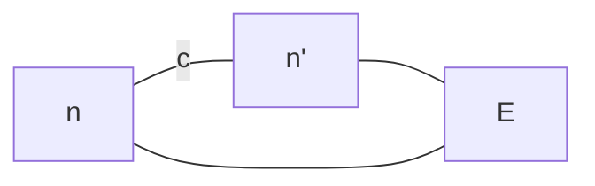

A\*搜索：在评价函数中考虑从起始节点到当前节点的路径代价  $f(n)=g(n)+h(n)$  

其中$g(n)$为起始节点到节点$n$代价（当前最小代价）

例：

> 处处最优 $\Rightarrow$ 全局最优

性能分析：A\*算法的完备性和最优性取决于搜索问题和启发函数的性质

+ 记号：
	+ $h(n)$：结点n的启发函数取值（直线距离）
	+ $g(n)$：从起始结点到结点n所对应路径的代价
	+ $f(n)$：结点n的评价函数取值
	+ $c(n,a,n')$：从结点n执行动作a到达结点n'的单步代价
	+ $h^*(n)$：从结点n出发到达终止结点的最小代价（实际距离）
+ 可容性：$\forall n:h(n)\leqslant h^*(n)$，即启发函数不会过高估计从节点$n$到终止节点所应该付出的代价（即估计代价小于等于实际代价）
+ 一致性： $h(n)\leqslant c(n,a,n')+h(n')$三角不等式

定理1：一致 $\Rightarrow$ 可容

> 证：设最短路为$n_1\to n_2\to\cdots\to K$  $h(K)=0$
> 
> $\because$一致  
> 
> $\therefore h(n_1)\leqslant h(n_2)+c(n_1,a_1,n_2)\leqslant h(n_3)+c(n_2,a_2,n_3)+c(n_1,a_1,n_2)$$\leqslant\cdots\leqslant c(n_1,a_1,n_2)+c(n_2,a_2,n_3)+\cdots+c(n_1,a_1,K)=h^*(n_1)$

定理2：A\*完备性

+ 搜索树中的分支数量是有限的，即每个结点的后继结点数量是有限的
+ 单步代价的下界是一个正数
+ 启发函数有下界

定理3：可容 $\Rightarrow$ 最优
> 证：假设A\*找到的终点为$n$，$\forall n'\in$边缘节点，$f(n)\leqslant f(n')$
> 
> $\therefore f(n)=g(n)+h(n)=g(n)\leqslant f(n')=g(n')+h(n')\leqslant g(n')+h^*(n')$
> 
> $\therefore$为最短路

