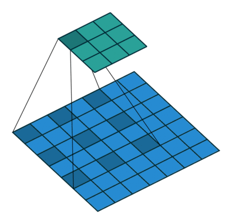

# CNN进阶知识总结

## CNN的动机

不用考虑整个图片，只想考虑局部特征，我们引入了receptive field(感受野)。receptive field在图像处理领域一般为3*3，但是在其他的任务中可以被精心设计。比如，可以不连续，可以是奇形怪状的……

我们使用filter来提取特征。filter是可学习的。我们使用很多个filter来描述一个receptive field。经过一个卷积层后，**得到的输出的channel数=filter数**。一个filter就产生一个channel。

stride（步长）我们一般设置为1或2，这是因为我们希望有重叠（overlap），这样可以检测到全部区域。

如果超出范围，需要做padding。padding可以补0，也可以补其他的，可以被设计。一般上下左右都要padding。

经过卷积层后的输出我们称之为feature map。

假设输入形状为 $(n_h * n_w)$，卷积核形状为 $(k_h * k_w)$，总共添加了 $p_h$ 行和 $p_w$ 列的padding，垂直步幅为 $s_h$ ，水平步幅为 $s_w$ 时，输出形状为：

$$(output_h,output_w)=( \left\lfloor \frac{n_h+p_h-k_h}{s_h} \right\rfloor + 1 , \left\lfloor \frac{n_w+p_w-k_w}{s_w} \right\rfloor +1 )$$

特别注意，在调用pytorch的卷积的时候，padding的参数是tuple(元组)，就可以直接带入公式。如果是整数p，则代表 $p=0.5*p_h=0.5*p_w$ ，所以代入公式时p要先乘2

## Transposed CNN 转置卷积

### 动机
卷积层只会让矩阵越来越小。如何让矩阵变大？（有的时候要求保持分辨率输出）答：采用转置卷积

### 原理
首先，传统CNN可以表示为矩阵乘积形式。假设输入形状为 $(n_h * n_w)$，把它flatten变成 $((n_h+n_w) * 1)$ 的矩阵。则卷积可以用矩阵乘法形式写成 $$ WX=Y $$

此时$Y$的维度是小于$X$的。

注意这里的$W$并不是随意的矩阵，它需要满足一些条件（拥有着特定的构造），里面有特定位置的元素为0，其他位置是原来filter里面元素的重复排列。具体特征可以举个例子手推。

下面保持原来$W$的特征不变，把它转置，我们得到一个$W^T$

用$W^T$去左乘和$Y$一样形状的输入，可以得到和$X$一样形状的输出。但请注意，$W^TY \neq X$

如果我们还原回原来的卷积操作，可以发现：只要维持$W$的特征不变，那么在卷积层面上，这一步操作可以理解为：把输入的张量的每个元素作为权重乘以$W$，按步长排列后相同位置处相加。

总结：如果卷积将输入从(h,w)变为(h',w')，转置卷积在同样超参数下将(h',w')变为(h,w)。

这就是转置卷积的由来。

注：特别注意，由于这个时候我们的参数直接沿用的正常卷积，所以padding的意义变成了：输出最外面的一圈。

### 操作
具体操作时，我们需要想办法在卷积层面还原成和CNN一样的形式。我们通过补0来实现。具体方法为：在输入的相邻两行/列的中间分别添加 $s_h-1$ 行， $s_w-1$列0元素。在输入的上下总共添加 $2k_h-2-p_h$ 行， 左右总共 $2k_w-2-p_w$ 列。然后把卷积核上下左右翻转。

接下来做正常CNN一样的且stride=1，padding=0的卷积即可。


### 输出公式
假设输入形状为 $(n_h * n_w)$，卷积核形状为 $(k_h * k_w)$，padding为 $p_h$ 和 $p_w$ ，垂直步幅为 $s_h$ ，水平步幅为 $s_w$ 时：

1. 从原理上直接计算，可以得到输出为 $((n_h-1)s_h+k_h-p_h , (k_h-1)s_h+n_h-p_w)$。注意需要直接减去padding的大小（没什么实际意义，就为了参数统一）。

2. 从实际操作上来计算，等价于输入为 

$$
\begin{align*}
(n'_h,n'_w) &= (n_h + (n_h-1)(s_h-1)+2(k_h-p_h-1) , n_w + (n_w-1)(s_w-1)+2(k_w-p_w-1)) \\
&= (n_h*s_h-s_h+2k_h-2p_h-1 ,n_w*s_w-s_w+2k_w-2p_w-1) 
\end{align*}
$$ 

和将步长为1填充为0带入传统CNN的公式，得到输出为

$$ ((n_h-1)s_h+k_h-p_h,(n_w-1)s_w+k_w-p_w) $$

3. 直接把原始式子的 $output_h$ 和 $n_h$， $output_w$ 和$n_w$对调。直接把取整去掉因为反方向不存在不整除的问题。得到结果为

$$ ((n_h-1)s_h+k_h-p_h,(n_w-1)s_w+k_w-p_w) $$


可以看到三者答案相同。

### 接口
torch.nn.ConvTranspose2d参数：

- in_channels(int):输入大小
- out_channels(int):输出大小
- kernel_size(int or tuple):卷积核大小
- stride(int or tuple,optional):步长。默认1。
- padding(int or tuple,optional):填充，注意可能为整数可能为元组，定义同传统CNN（公式整数的话公式中p要乘2）。默认0。
- output_padding(int or tuple,optional):输出加的额外的padding，默认为0。
- groups(int,optional):是否使用分组卷积。默认1（传统卷积）。
- bias(bool,optinal):是否加偏置，默认为True
- dilation(int or tuple,optional):是否使用空洞卷积，默认为1（普通卷积）

## U-net
结构见下图：


其中绿色箭头就是转置卷积。

解码在将下采样(反卷积)数据恢复的时候，特征scale会发生变化，必然会有信息的丢失，这个时候, skip connention的作用就凸显出来了, skip connention起到了补充信息的作用。灰色箭头就是skip connention。在U-Net中采用叠操作（concatenation） ,这里也指的是复制和剪切(copy and crop)
## Dilated Convolutions

### 优势
虽然池化层也可以扩大感受野，但是会使得分辨率变低。Dilated Convolutions可以在扩大感受野保持分辨率。

### 重要原理
示意图如下：



膨胀卷积的r是相邻间隔的距离。也就是说r=1的时候是普通卷积。r=2就是间隔1，即上图的情况。

### Hybrid Dilated Convolution(HDC):

当设计多个膨胀卷积层堆叠的时候，$r=[r_1,r_2,...,r_n]$ 需要满足：$M_i=max\{M_{i+1}-2r_i,M_{i+1}-2(M_{i+1}-r_i),r_i\}$ ，其中 $M_n=r_n$，且需满足 $M_2\leq K$。我们一般取 $r_1=1$。

论文中还建议将r设置为$r=[1,2,3,1,2,3]$这种锯齿结构，并要求r的公约数不大于1，否则会出现感受野中有元素权重为0的情况。如下图：


我们希望感受野如下图：


## 经典网络实现汇总

### LeNet

```python
net = nn.Sequential(
    nn.Conv2d(1, 6, kernel_size=5, padding=2), nn.Sigmoid(),
    nn.AvgPool2d(kernel_size=2, stride=2),
    nn.Conv2d(6, 16, kernel_size=5), nn.Sigmoid(),
    nn.AvgPool2d(kernel_size=2, stride=2),
    nn.Flatten(),
    nn.Linear(16 * 5 * 5, 120), nn.Sigmoid(),
    nn.Linear(120, 84), nn.Sigmoid(),
    nn.Linear(84, 10))
```

### AlexNet

```python
net = nn.Sequential(
    nn.Conv2d(1, 96, kernel_size=11, stride=4, padding=1), nn.ReLU(),
    nn.MaxPool2d(kernel_size=3, stride=2),
    nn.Conv2d(96, 256, kernel_size=5, padding=2), nn.ReLU(),
    nn.MaxPool2d(kernel_size=3, stride=2),
    nn.Conv2d(256, 384, kernel_size=3, padding=1), nn.ReLU(),
    nn.Conv2d(384, 384, kernel_size=3, padding=1), nn.ReLU(),
    nn.Conv2d(384, 256, kernel_size=3, padding=1), nn.ReLU(),
    nn.MaxPool2d(kernel_size=3, stride=2),
    nn.Flatten(),
    nn.Linear(6400, 4096), nn.ReLU(),
    nn.Dropout(p=0.5),
    nn.Linear(4096, 4096), nn.ReLU(),
    nn.Dropout(p=0.5),
    # 由于这里使用Fashion-MNIST，所以用类别数为10，而非论文中的1000
    nn.Linear(4096, 10))
```

### VGG

```python
def vgg_block(num_convs, in_channels, out_channels):
    layers = []
    for _ in range(num_convs):
        layers.append(nn.Conv2d(in_channels, out_channels,kernel_size=3, padding=1))
        layers.append(nn.ReLU())
        in_channels = out_channels
    layers.append(nn.MaxPool2d(kernel_size=2,stride=2))
    return nn.Sequential(*layers)

def vgg(conv_arch):
    conv_blks = []
    in_channels = 1
    # 卷积层部分
    for (num_convs, out_channels) in conv_arch:
        conv_blks.append(vgg_block(num_convs, in_channels, out_channels))
        in_channels = out_channels
    return nn.Sequential(
        *conv_blks, nn.Flatten(),
        # 全连接层部分
        nn.Linear(out_channels * 7 * 7, 4096), nn.ReLU(), nn.Dropout(0.5),
        nn.Linear(4096, 4096), nn.ReLU(), nn.Dropout(0.5),
        nn.Linear(4096, 10))

conv_arch = ((1, 64), (1, 128), (2, 256), (2, 512), (2, 512))

net = vgg(conv_arch)
```

### NiN
``` python
def nin_block(in_channels, out_channels, kernel_size, strides, padding):
    return nn.Sequential(
        nn.Conv2d(in_channels, out_channels, kernel_size, strides, padding),
        nn.ReLU(),
        nn.Conv2d(out_channels, out_channels, kernel_size=1), nn.ReLU(),
        nn.Conv2d(out_channels, out_channels, kernel_size=1), nn.ReLU())

net = nn.Sequential(
    nin_block(1, 96, kernel_size=11, strides=4, padding=0),
    nn.MaxPool2d(3, stride=2),
    nin_block(96, 256, kernel_size=5, strides=1, padding=2),
    nn.MaxPool2d(3, stride=2),
    nin_block(256, 384, kernel_size=3, strides=1, padding=1),
    nn.MaxPool2d(3, stride=2),
    nn.Dropout(0.5),
    nin_block(384, 10, kernel_size=3, strides=1, padding=1),
    nn.AdaptiveAvgPool2d((1, 1)),
    nn.Flatten())
     
```

### GoogLeNet
``` python
class Inception(nn.Module):
    # c1--c4是每条路径的输出通道数
    def __init__(self, in_channels, c1, c2, c3, c4, **kwargs):
        super(Inception, self).__init__(**kwargs)
        # 线路1，单1x1卷积层
        self.p1_1 = nn.Conv2d(in_channels, c1, kernel_size=1)
        # 线路2，1x1卷积层后接3x3卷积层
        self.p2_1 = nn.Conv2d(in_channels, c2[0], kernel_size=1)
        self.p2_2 = nn.Conv2d(c2[0], c2[1], kernel_size=3, padding=1)
        # 线路3，1x1卷积层后接5x5卷积层
        self.p3_1 = nn.Conv2d(in_channels, c3[0], kernel_size=1)
        self.p3_2 = nn.Conv2d(c3[0], c3[1], kernel_size=5, padding=2)
        # 线路4，3x3最大汇聚层后接1x1卷积层
        self.p4_1 = nn.MaxPool2d(kernel_size=3, stride=1, padding=1)
        self.p4_2 = nn.Conv2d(in_channels, c4, kernel_size=1)

    def forward(self, x):
        p1 = F.relu(self.p1_1(x))
        p2 = F.relu(self.p2_2(F.relu(self.p2_1(x))))
        p3 = F.relu(self.p3_2(F.relu(self.p3_1(x))))
        p4 = F.relu(self.p4_2(self.p4_1(x)))
        # 在通道维度上连结输出
        return torch.cat((p1, p2, p3, p4), dim=1)

b1 = nn.Sequential(nn.Conv2d(1, 64, kernel_size=7, stride=2, padding=3),
                   nn.ReLU(),
                   nn.MaxPool2d(kernel_size=3, stride=2, padding=1))

b2 = nn.Sequential(nn.Conv2d(64, 64, kernel_size=1),
                   nn.ReLU(),
                   nn.Conv2d(64, 192, kernel_size=3, padding=1),
                   nn.ReLU(),
                   nn.MaxPool2d(kernel_size=3, stride=2, padding=1))

b3 = nn.Sequential(Inception(192, 64, (96, 128), (16, 32), 32),
                   Inception(256, 128, (128, 192), (32, 96), 64),
                   nn.MaxPool2d(kernel_size=3, stride=2, padding=1))
        
    
b4 = nn.Sequential(Inception(480, 192, (96, 208), (16, 48), 64),
                   Inception(512, 160, (112, 224), (24, 64), 64),
                   Inception(512, 128, (128, 256), (24, 64), 64),
                   Inception(512, 112, (144, 288), (32, 64), 64),
                   Inception(528, 256, (160, 320), (32, 128), 128),
                   nn.MaxPool2d(kernel_size=3, stride=2, padding=1))

b5 = nn.Sequential(Inception(832, 256, (160, 320), (32, 128), 128),
                   Inception(832, 384, (192, 384), (48, 128), 128),
                   nn.AdaptiveAvgPool2d((1,1)),
                   nn.Flatten())

net = nn.Sequential(b1, b2, b3, b4, b5, nn.Linear(1024, 10))
```

### ResNet
``` python
class Residual(nn.Module):  #@save
    def __init__(self, input_channels, num_channels,
                 use_1x1conv=False, strides=1):
        super().__init__()
        self.conv1 = nn.Conv2d(input_channels, num_channels,
                               kernel_size=3, padding=1, stride=strides)
        self.conv2 = nn.Conv2d(num_channels, num_channels,
                               kernel_size=3, padding=1)
        if use_1x1conv:
            self.conv3 = nn.Conv2d(input_channels, num_channels,
                                   kernel_size=1, stride=strides)
        else:
            self.conv3 = None
        self.bn1 = nn.BatchNorm2d(num_channels)
        self.bn2 = nn.BatchNorm2d(num_channels)

    def forward(self, X):
        Y = F.relu(self.bn1(self.conv1(X)))
        Y = self.bn2(self.conv2(Y))
        if self.conv3:
            X = self.conv3(X)
        Y += X
        return F.relu(Y)

    b1 = nn.Sequential(nn.Conv2d(1, 64, kernel_size=7, stride=2, padding=3),
                   nn.BatchNorm2d(64), nn.ReLU(),
                   nn.MaxPool2d(kernel_size=3, stride=2, padding=1))

    def resnet_block(input_channels, num_channels, num_residuals,
                 first_block=False):
    blk = []
    for i in range(num_residuals):
        if i == 0 and not first_block:
            blk.append(Residual(input_channels, num_channels,
                                use_1x1conv=True, strides=2))
        else:
            blk.append(Residual(num_channels, num_channels))
    return blk

    b2 = nn.Sequential(*resnet_block(64, 64, 2, first_block=True))
    b3 = nn.Sequential(*resnet_block(64, 128, 2))
    b4 = nn.Sequential(*resnet_block(128, 256, 2))
    b5 = nn.Sequential(*resnet_block(256, 512, 2)) 

    net = nn.Sequential(b1, b2, b3, b4, b5,nn.AdaptiveAvgPool2d((1,1)),nn.Flatten(), nn.Linear(512, 10)) 
```

### DenseNet
``` python
def conv_block(input_channels, num_channels):
    return nn.Sequential(
        nn.BatchNorm2d(input_channels), nn.ReLU(),
        nn.Conv2d(input_channels, num_channels, kernel_size=3, padding=1))

class DenseBlock(nn.Module):
    def __init__(self, num_convs, input_channels, num_channels):
        super(DenseBlock, self).__init__()
        layer = []
        for i in range(num_convs):
            layer.append(conv_block(
                num_channels * i + input_channels, num_channels))
        self.net = nn.Sequential(*layer)

    def forward(self, X):
        for blk in self.net:
            Y = blk(X)
            # 连接通道维度上每个块的输入和输出
            X = torch.cat((X, Y), dim=1)
        return X


    #过渡层，这是由于每个稠密块都会带来通道数的增加，
    #使用过多则会过于复杂化模型。 而过渡层可以用来控制模型复杂度。 
    #它通过卷积层来减小通道数，并使用步幅为2的平均汇聚层减半高和宽，从而进一步降低模型复杂度。
def transition_block(input_channels, num_channels):
    return nn.Sequential(
        nn.BatchNorm2d(input_channels), nn.ReLU(),
        nn.Conv2d(input_channels, num_channels, kernel_size=1),
        nn.AvgPool2d(kernel_size=2, stride=2))

b1 = nn.Sequential(
    nn.Conv2d(1, 64, kernel_size=7, stride=2, padding=3),
    nn.BatchNorm2d(64), nn.ReLU(),
    nn.MaxPool2d(kernel_size=3, stride=2, padding=1))

# num_channels为当前的通道数
num_channels, growth_rate = 64, 32
num_convs_in_dense_blocks = [4, 4, 4, 4]
blks = []
for i, num_convs in enumerate(num_convs_in_dense_blocks):
    blks.append(DenseBlock(num_convs, num_channels, growth_rate))
    # 上一个稠密块的输出通道数
    num_channels += num_convs * growth_rate
    # 在稠密块之间添加一个转换层，使通道数量减半
    if i != len(num_convs_in_dense_blocks) - 1:
        blks.append(transition_block(num_channels, num_channels // 2))
        num_channels = num_channels // 2

net = nn.Sequential(
    b1, *blks,
    nn.BatchNorm2d(num_channels), nn.ReLU(),
    nn.AdaptiveAvgPool2d((1, 1)),
    nn.Flatten(),
    nn.Linear(num_channels, 10))
```
### 性能对比
|         | loss  | train acc  | test acc  |examples/sec on cuda:0|
|:-------:|:------:|:------:|:------:|:------:|
| LeNet   | 0.469 | 0.823 | 0.779 |35726.4|
| AlexNet  | 0.331 | 0.878  | 0.883 |3941.8|
| VGG   | 0.178 | 0.935 | 0.920 |2463.7|
| NiN |0.370|0.866|0.877|3087.6|
| GoogLeNet |0.262|0.900|0.886|3265.5|
| ResNet |0.012|0.997|0.893|5032.7|
| DenseNet |0.140|0.948|0.885|5626.3|