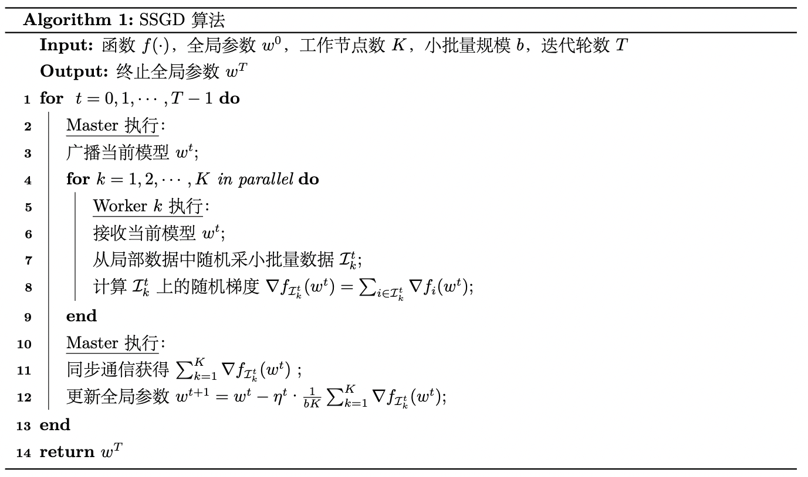
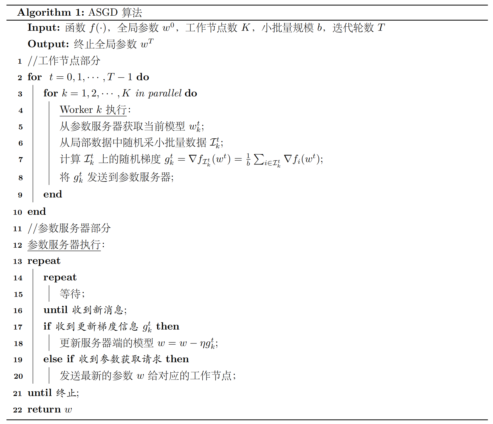

# 分布式机器学习


- 数据并行：对于训练数据大的问题，需要将数据进行划分并分配到多个工作节点(Worker)上进行训练，这种技巧一般被称为数据并行。

- 模型并行：对于模型规模大的问题，则需要对模型进行划分，并且分配到不同的工作节点上进行训练，这种技巧一般被称为模型并行。与数据并行不同，模型并行的框架下各个子模型之间的依赖关系非常强，因为某个子模型的输出可能是另外一个子模型的输入，如果不进行中间计算结果的通信，则无法完成整个模型训练。因此，一般而言，模型并行相比数据并行对通信的要求更高。

## 数据并行

### 同步并行SGD(SSGD)



### 数据并行SGD(ASGD)



## 代码


```
import torch
import torch.distributed as dist
import argparse #用于解析命令行参数

parser = argparse.ArgumentParser() # 创建一个解析器对象
parser.add_argument("--local_rank", default=-1) # 添加 local_rank 参数，用于指定当前进程在本地的 GPU 编号
FLAGS = parser.parse_args() # 解析命令行参数并存储在 FLAGS 中
local_rank = FLAGS.local_rank # 获取 local_rank 参数的值

torch.cuda.set_device(local_rank) # 设置当前进程要使用的 GPU 设备，local_rank 对应的是该进程使用的 GPU 编号
dist.init_process_group(backend='nccl')  # 指定通信后端为NCCL

device = torch.device("cuda", local_rank) # 创建一个表示当前设备的 CUDA 设备对象
model = nn.Linear(10, 10).to(device) # 创建一个线性模型并将其移动到当前设备上
model = DDP(model, device_ids=[local_rank], output_device=local_rank) # 将模型包装为DDP

outputs = model(torch.randn(20, 10).to(rank)) # 随机输入，获取输出
labels = torch.randn(20, 10).to(rank) # 生成随机label
loss_fn = nn.MSELoss() #创建loss
loss_fn(outputs, labels).backward() #反向传播

optimizer = optim.SGD(model.parameters(), lr=0.001) #优化器
optimizer.step() #优化器

```

Bash运行：

```
# 使用torch.distributed.launch启动DDP模式，其会给main.py一个local_rank的参数
python -m torch.distributed.launch --nproc_per_node 4 main.py
```

