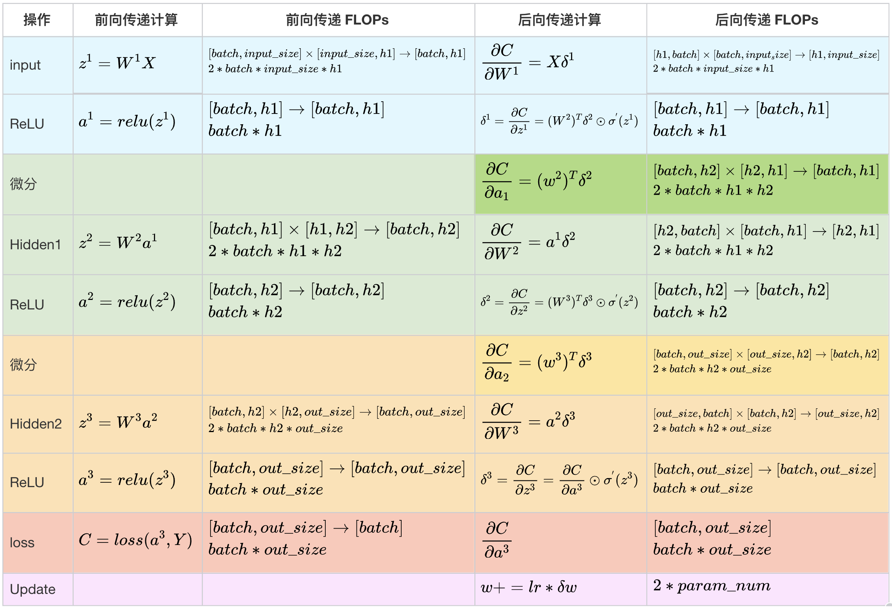

# Notes of *Dive into Deepleaning*

这里是笔者在学习《动手学深度学习》遇到的一些问题及解答，如有错误请指正

## 知识问题
---
- Q：为什么要抽样小批量
- A：
---
- Q：softmax计算的时候有什么技巧？
- A：原函数是 $\hat{y} = \frac{e^{ o_{j}} }{\sum_{k}{e^{o_{k}}}}$，如果某个 $ O_k$ 非常大，则会导致分母特别大，超出数据范围，此为上溢。解决办法：$\hat{y} = \frac{e^{ o_{j}}e^{-o_{max}} }{\sum_{k}{e^{o_{k}} e^{-o_{max}}}}$ = $\frac{e^{o_j-o_{max}}}{\sum_{k}{e^{o_k-o_{max}}}}$ ，但这样会出现分子特别小，甚至接近0的情况，使得log之后为负无穷，此为下溢。所以，进一步改进：

$$
\begin{align*}
\log{(\hat y_j)} &= \log\left( \frac{\exp(o_j - \max(o_k))}{\sum_k \exp(o_k - \max(o_k))}\right)  \\
&= \log{(\exp(o_j - \max(o_k)))}-\log{\left( \sum_k \exp(o_k - \max(o_k)) \right)}  \\
&= o_j - \max(o_k) -\log{\left( \sum_k \exp(o_k - \max(o_k)) \right)}.
\end{align*}
$$

---

- Q：L1范数和L2范数的区别？
- A：L1是每次梯度下降都减去一个常数，因此L1范数可以使得权重矩阵更稀疏（更容易回归零），从而达到特征选择的目的。如果没有特征选择的要求，一般选择L2范数。L2范数每次梯度下降都是减去一个线性缩放的值，而非常数。

---

- Q：从直观来看，为了减少参数量，我们应该选择L0范数（非零元素个数）。为什么不选择L0范数？
- A：L0范数是NP-C（NP完全）问题。且L0范数和L1范数的作用以概率1相等

---

- Q：avg和maxpool的使用场景？
- A：最大池化保留了纹理特征,平均池化保留整体的数据特征;

---
- Q:为什么反传是前向传播两倍？
- A:

## 技术问题
- Q：下载d2l时遇到问题：Failed to build pandas ERROR: Could not build wheels for pandas, which is required to install pyproject.toml-based projects
- A：经排查是d2l的问题，改为pip install d2l==0.17.0
---

- Q：为什么Y=torch.zeros((X.shap[0]-h+1,X.shape[1]-w+1))要加两个括号？
- A：因为torch.zeros后面要求一个元组，而两个括号保证了是一个元组。

## 重点
- 在高斯噪声的假设下，最小化均方误差等价于对线性模型的极大似然估计。

- 由于计算的损失是一个批量样本的总和，所以要除以batch_size来规范化步长

- 为什么不采用sigmoid而采用relu：sigmoid在输入值太小或太大时会发生梯度消失。同时ReLu会使一部分神经元的输出为0，这样就造成了网络的稀疏性，并且减少了参数的相互依存关系，缓解了过拟合问题的发生。

- Xiever初始化：想要自身的方差不变，需要设置方差为 $\frac{1}{n_{in}}$。想要梯度方差不变，需要设置方差为 $\frac{1}{n_{out}}$，但不能兼得，所以设置方差为 $\sqrt{ \frac{2}{n_{in} + n_{out}} }$  

- pooling层作用：降低卷积层对位置的敏感性，同时降低对空间降采样表示的敏感性。

- 默认情况下，深度学习框架中的步幅与汇聚窗口的大小相同。