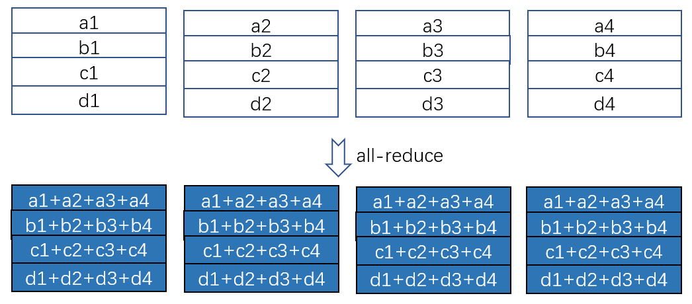
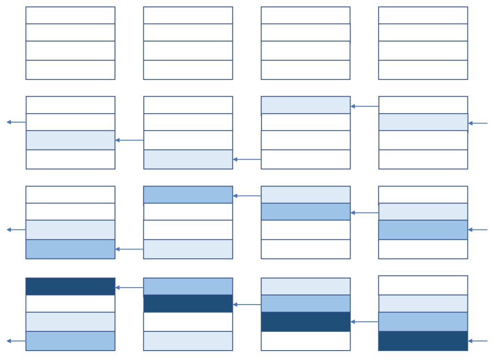
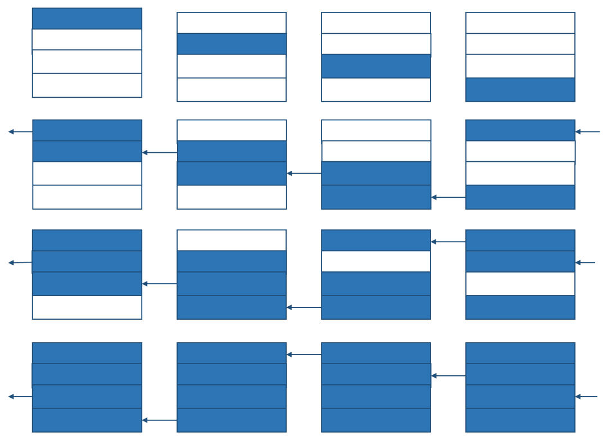

# Ring all-reduce 算法

## all-reduce

all-reduce是一类算法，目标是高效得将不同机器中的数据整合（reduce）之后再把结果分发给各个机器。

我们接下来进行一些复杂度分析。假设有 $p$ 个设备，每个设备（卡）上的数据量是 $V$ ，设备之间的通信带宽是 $\beta$ 。

将all-reduce问题的目标特殊化，我们考虑下面这个问题：

每个设备上有一个矩阵（为简单起见，我们特意让每一行就一个元素）。现在我们希望让每个设备上的矩阵里的每一个位置的数值都是所有设备上对应位置的数值之和。

即我们希望：

如果采用最朴素的算法，即让每一台设备把自己的数据直接发送给其他所有设备，时间为 $\frac{p(p-1)V}{\beta}$，发出总数据为 $p(p-1)V$。

## ring all-reduce 算法

一个很高效的算法，分为两步：reduce-scatter和all-gather

### reduce-scatter

过程如下图：

整个过程，每个设备发出和接受的信息都是 $\frac{(p-1)V}{p}$ ，因此传递总数据量为 $(p-1)V$。又由于带宽是 $\beta$ ，且每个设备都持续在工作，所以花费时间为 $\frac{(p-1)V}{p\beta}$ 。当 $p$ 趋近于正无穷，花费时间趋近于 $\frac{V}{\beta}$。因此在p足够大的时候，时间与设备数无关。

### all-gather

过程如下图：

分析过程与reduce-scatter一模一样

### 冗余显存

在reduce-scatter后，由于每个设备都只有 $\frac{V}{p}$ 的信息有价值，因此每个设备 $\frac{V(p-1)}{p}$ 的显存是冗余的，因此所有设备共有 $V(p-1)$ 的显存冗余。

在all-gather后，所有设备储存的信息都一样，且信息量都为 $V$ ，因此也有 $V(p-1)$ 的显存冗余。

综上，ring all-reduce 算法的显存冗余为 $V(p-1)$ ，这正好等于所有设备的总通信量。这并非偶然，因为正式这些通信才造成了显存冗余。

### 最优性

要计算总和，至少要把 $p-1$ 台设备中的数据传到一台中，所以总传输量至少是 $(p-1)V$。又由于ring all-reduce算法中，所有端口都在持续运行，所以它从传输量和时间上来说都是最优的。