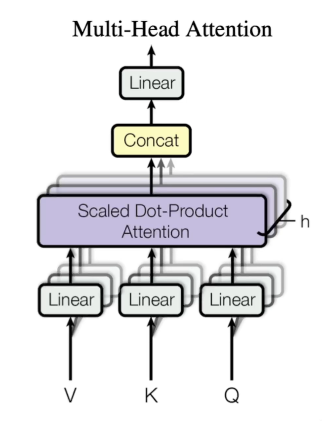

# Transformer 教程

## Attention机制

Attention机制的本质是**加权求和**。

问题本质是一个回归问题：给定的成对的“输入－输出”数据集 $\{(x_1, y_1), \ldots, (x_n, y_n)\}$ 如何学习 $f$ 来预测任意新输入的输出 $\hat{y} = f(x)$

规范表述：假设有一个查询 $\mathbf{q} \in \mathbb{R}^q$ 和 $m$ 个“键－值”对 $(\mathbf{k}_1, \mathbf{v}_1)$, $\ldots, (\mathbf{k}_m, \mathbf{v}_m)$ ，其中 $\mathbf{k}_i \in\mathbb{R}^k$ ， $\mathbf{v}_i \in \mathbb{R}^v$。注意力汇聚函数就被表示成值的加权和：

$$
f(\mathbf{q}, (\mathbf{k}_1, \mathbf{v}_1), \ldots, (\mathbf{k}_m, \mathbf{v}_m)) = \sum_{i=1}^m \alpha(\mathbf{q}, \mathbf{k}_i) \mathbf{v}_i \in \mathbb{R}^v 
$$

其中，

$$
\alpha(\mathbf{q}, \mathbf{k}_i) = \mathrm{softmax}(a(\mathbf{q}, \mathbf{k}_i)) = \frac{\exp(a(\mathbf{q}, \mathbf{k}_i))}{\sum_{j=1}^m \exp(a(\mathbf{q}, \mathbf{k}_j))} \in \mathbb{R}
$$

注释：

- 查询 $q$ 和键 $k_i$ 越接近，他们的 $\alpha(\mathbf{q}, \mathbf{k}_i)$ 就越大，也就获得了更多的注意力

- $\alpha(\mathbf{q}, \mathbf{k})$ 是概率密度函数

在Transformer中，**查询和键的特征维度 $d$ 相同**，所以我们取评分函数为：$a(\mathbf q, \mathbf k) = \frac{\mathbf{q}^\top \mathbf{k}}{\sqrt{d}}$

写成批量形式，设查询 $\mathbf Q\in\mathbb R^{n\times d}$、 键 $\mathbf K\in\mathbb R^{m\times d}$ 值 $\mathbf V\in\mathbb R^{m\times v}$ ,则：

$$
\mathrm{softmax}\left(\frac{\mathbf Q \mathbf K^\top }{\sqrt{d}}\right) \mathbf V \in \mathbb{R}^{n\times v}
$$

## Self-Attention机制

顾名思义指的是 $\mathbf Q=\mathbf K=\mathbf V$ 时的注意力机制。

**意义**：通过乘注意力矩阵，**修改**了每个词的**语义**，使每个词的语义结合了**上下文**。

## Multi-Head Attention机制

如下图。目的是**希望线性层学到不同的投影规则**。

可以类比为CNN的通道数

## Positional Encoding

设输入 $\mathbf{X} \in \mathbb{R}^{n \times d}$ ，要求构造位置矩阵 $\mathbf{P} \in \mathbb{R}^{n \times d}$ ，编码后输出 $\mathbf{X} + \mathbf{P}$

先给出公式,矩阵第 $i$ 行、第 $2j$ 列和 $2j+1$ 列上的元素为：

$$
\begin{split}\begin{aligned} p_{i, 2j} &= \sin\left(\frac{i}{10000^{2j/d}}\right),\\p_{i, 2j+1} &= \cos\left(\frac{i}{10000^{2j/d}}\right).\end{aligned}\end{split}
$$

个人认为比较好的理解：位置和位置矩阵的关系类似**傅里叶变换对**。即，将某个位置 $i$ **投影** 成一个 $d$ 维向量，$n$ 个位置就是一个 $\mathbb{R}^{n \times d}$ 矩阵，这样它就可以和输入矩阵相加。

至于具体为什么是这种形式，还没有什么好想法。（或许只是因为这种形式恰好有效？）

## Position-wise Feed-Forward Networks

解释一下与普通MLP不同之处：这里输入是n个d维向量，对每个d维向量分别作MLP，输出也是n个d维向量。这个MLP的参数是共享的。

## Add & Norm 

采用Layer Norm:norm的方向改变了

采用残差连接

## Mask机制

### Padding Mask

由于输入序列长度不一样，我们需要对输入特征进行对齐。

具体而言，对于较短的长度的词向量，在后面添加负无穷，这样softmax后就为0。对于较长的，直接截断。

当值是0的时候，点乘后也是0，所以这个位置的权重就变为0，也就是无视该位置的影响。

### Sequence Mask

Sequence Mask是为了使得Decoder不能看见未来的信息。

具体而言，产生一个上三角矩阵 $\in\mathbb R^{n\times m}$，上三角的值全为负无穷。然后与原来的 $\mathbf Q \mathbf K^\top$ 相加，再进行后续运算。这样负无穷的地方经过softmax后会变成0。

## Bert

