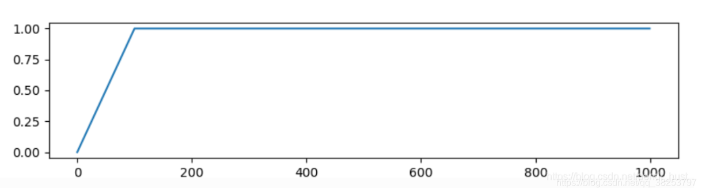
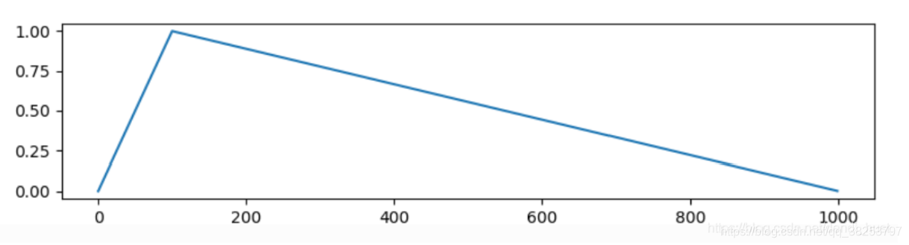
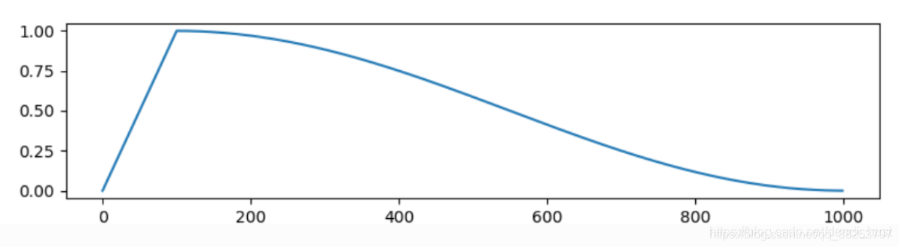

# Warm up

## 引言

首次在resnet论文中提出。

刚开始训练时，模型的weight是随机初始化的，此时若选择一个较大的学习率,可能导致模型振荡。

采用warm up，即使得开始训练的几个epoches或者一些steps内学习率较小。在预热的小学习率下，模型可以慢慢趋于稳定，等模型相对稳定后再选择预先设置的学习率进行训练，使得模型收敛速度变得更快，模型效果更佳。

## 常用的warm up

### Constant Warmup

学习率从非常小的数值线性增加到预设值之后保持不变。



### Linner Warmup

学习率从非常小的数值线性增加到预设值之后，然后再线性减小。



### Cosine Warmup

学习率先从很小的数值线性增加到预设学习率，然后按照cos函数值进行衰减。



### Gradual Warmup

从一个很小的学习率一下变为比较大的学习率可能会导致训练误差突然增大。于是18年Facebook提出了gradual warmup来解决这个问题，即从最初的小学习率开始，每个step增大一点点，直到达到最初设置的比较大的学习率时，采用最初设置的学习率进行训练。

下面为一个示例。其中schedular的含义是经过10个epoch的warm up，学习率由0.01逐渐上升至0.01*10=0.1，从第11代开始学习率策略将按照schedular_r进行衰减。

```
from warmup_scheduler import GradualWarmupScheduler

optimizer = optim.SGD(net.parameters(), lr=learning_rate, momentum=0.9,weight_decay=weight_decay)
schedular_r = torch.optim.lr_scheduler.ReduceLROnPlateau(optimizer, mode='max',factor=0.1, patience=3, verbose=True, eps=1e-5)

schedular = GradualWarmupScheduler(optimizer, multiplier=10, total_epoch=10,after_scheduler=schedular_r)
   
```