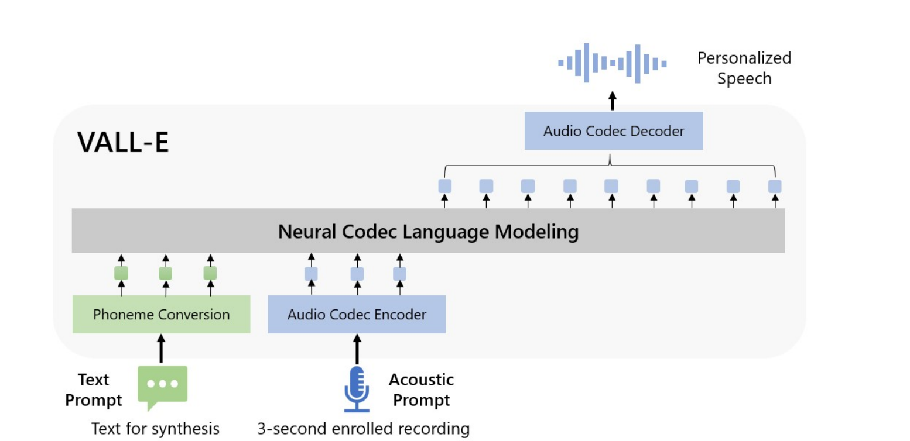
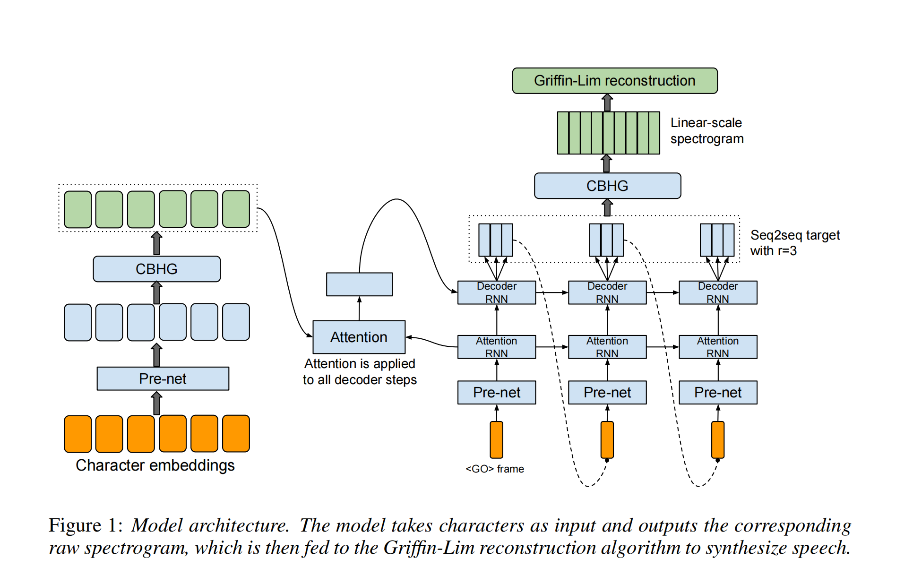
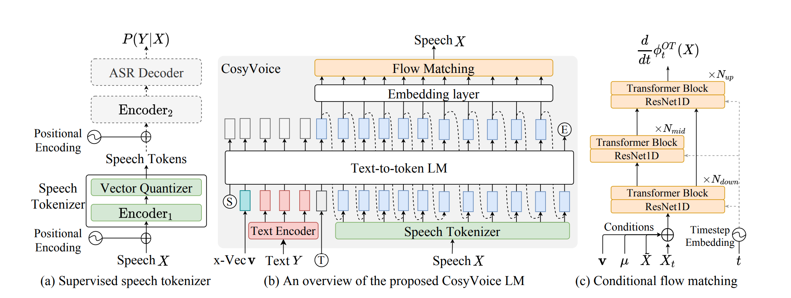
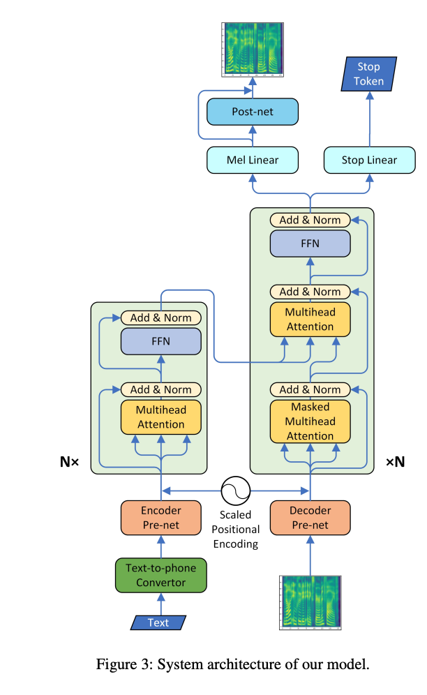
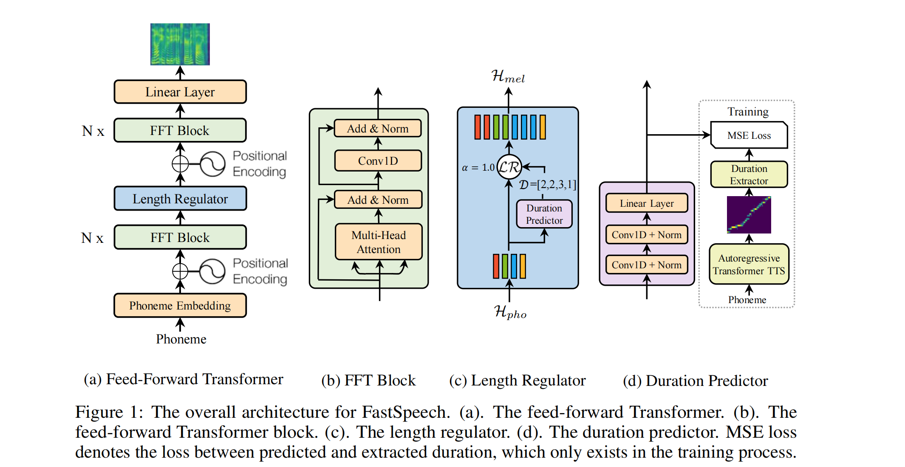
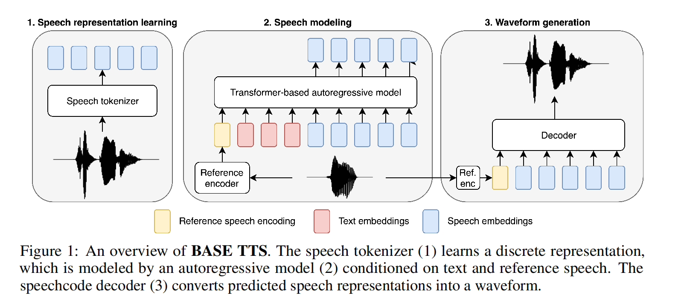
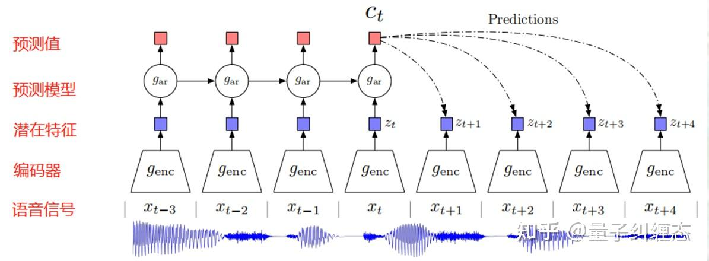
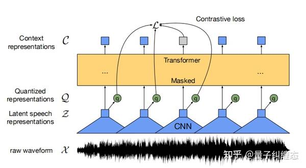
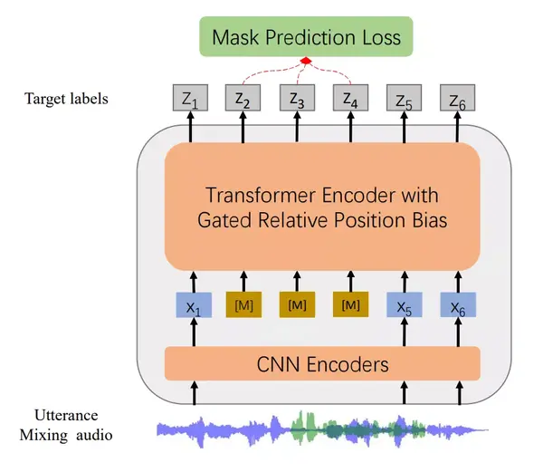

## TTS

### VALL-E

思路：延续了cascaded TTS(级联TTS)的思路，但是不采用梅尔频谱而是采用 audio codec code 作为中间表示。

### Tacotron

- 第一个端对端的模型，输入raw text，Tacotron可以直接输出mel-spectrogram，再利用Griffin-Lim算法生成波形

- autogressive TTS

### cosyVoice

Q：如果做一个对齐，把文本和语音的token对齐（类似Forced Alignment），然后仅把Y的第一个token作为prompt，后面X和Y的token成对输入，是否实现了流式？

Q：流式的衡量标准？是根据模型的延迟程度和RTF（模型处理时间和音频长度的比值）来的吗？

### Transformer TTS 

关键：作了文本和语音的对齐。

### FastSpeech

- non-autogressive TTS

- 由于mel-spec的长度要远远大于输入的音素的长度，仅仅利用self-attention是无法解决这个问题的，因此作者提出了length regulator

- length regulator用到了duration predictor：需要用autogressive TTS来训练

### FastSpeech2

- 使用了variance adaptor 来引入更多的输入来控制合成出的语音，这里不仅有phoneme duration也有energy和pitch

- 没有使用之前的从attention matrix中推断phoneme duration的方法，而是使用了forced alignment得到的duration作为训练的ground truth

- 实现了text-to-waveform，而不是text-to-mel-to-waveform

### BASETTS

## pre-trained model

### CPC

算法基本结构：

1. 输入，使用一维音频信号作为输入，而非FFT或者Fbank特征

2. 编码器enc，用于对一维信号进行编码,提取特征，一般是一维卷积。

3. 潜在特征z(t)，输入音频通过encoder卷积之后得到的输出。

4. 预测模型ar，将t时刻及之前的特征输入预测模型中，预测接下来几帧特征的值，一般为LSTM/RNN。

5. 上下文特征c(t)，预测模型的输出，也是最终用于微调下游任务的特征。

### wav2vec2.0

相比于CPC，使用了transformer代替了RNN，并且引入了一个乘积量化的操作（未看）。

### HuBert

类似Bert，有两个重点：

1. 怎么mask

使用了和wav2vec2类似的方法，首先选择p%的time-steps作为开始序号，然后从各个序号后面l数个steps作为要mask的区域。

2. 在哪里计算loss

mask区域上和非mask区域上的loss之和（乘系数调控）

### wavLM

1. 算法中强化了去噪的能力

在训练中，WavLM 会随机地对输入 wav 进行变换，例如：将两个 wav 进行混合，或者加入背景噪音。之后，再随机遮盖约50%的音频信号，并在输出端预测被遮盖位置所对应的标签。

2. 在transformer中使用gated relative position bias， 来强化输入音频的时序建模

公式见论文。（和positional encoding有什么区别？）

3. 增加了预训练的数据量，从常用的6wh librilight, 扩充到9.4wh的librilight + gigaspeech + voxpopuli

## 大模型
### teacher-forcing机制

decoder时，有两种方案：

1. teaching force:输入上一时刻的ground truth。问题：其中某一个单词预测错了，后面会跟着错，模型很难收敛。

2. 输入上一时刻的输出。问题：overcorrect。比如语法可能不正确。

