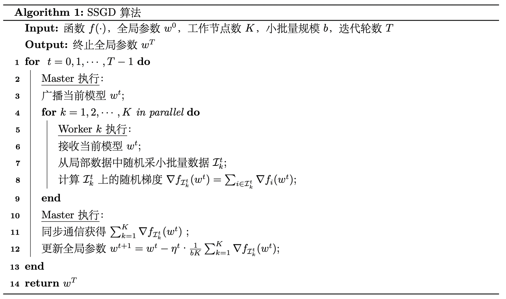
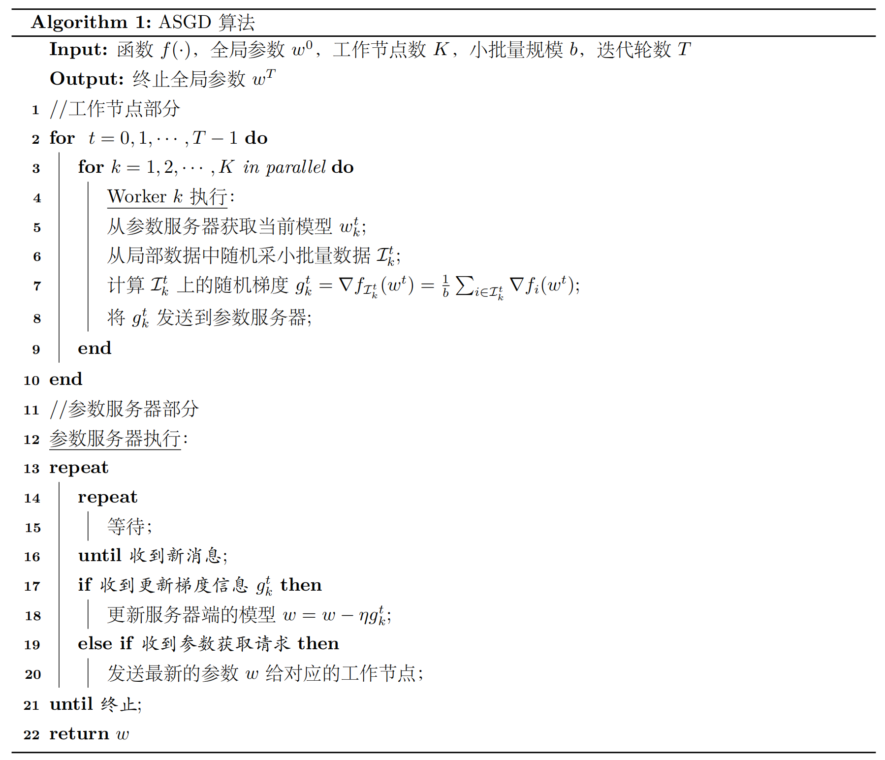
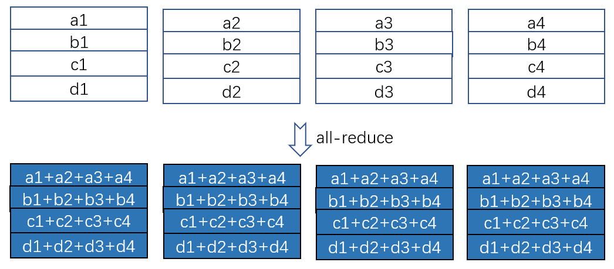
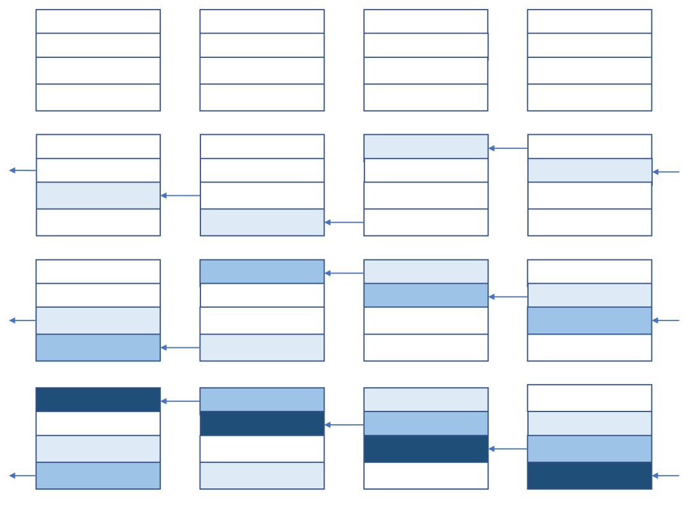
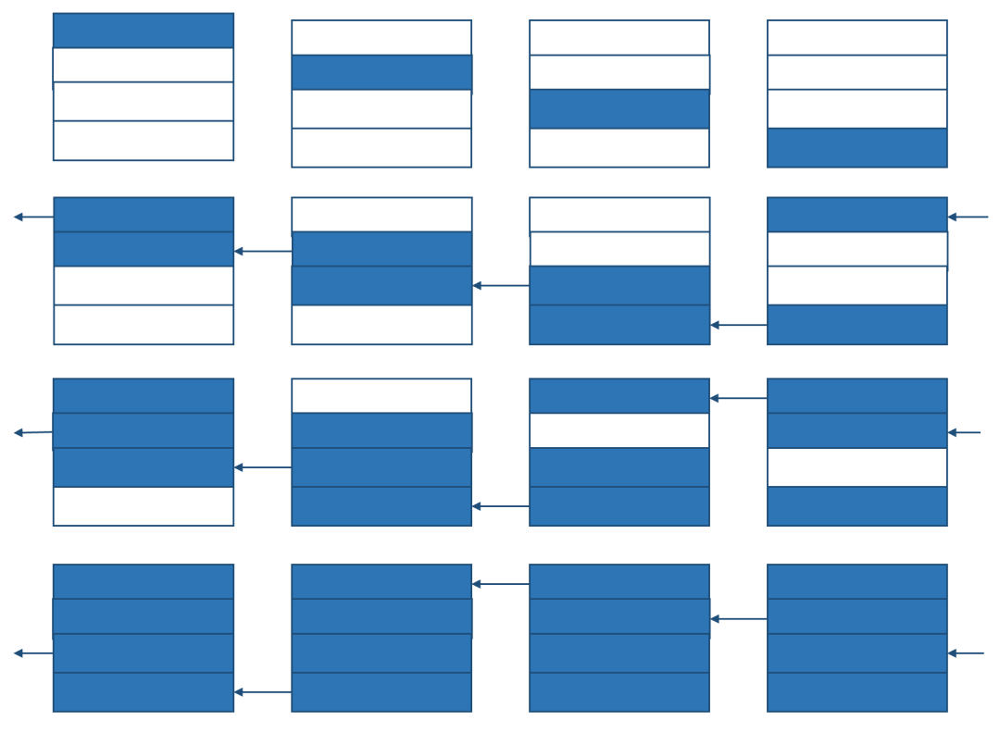

# 分布式机器学习

分布式机器学习是在大模型时代是一项不可或缺的技能。本文将讲述DDP从原理到实践的全部过程。

## 原理部分

### 什么是并行

有两种并行计算：数据并行和模型并行。

- 数据并行：对于训练数据大的问题，需要将数据进行划分并分配到多个工作节点(worker)上进行训练，这种技巧一般被称为数据并行。

- 模型并行：对于模型规模大的问题，则需要对模型进行划分，并且分配到不同的工作节点上进行训练，这种技巧一般被称为模型并行。与数据并行不同，模型并行的框架下各个子模型之间的依赖关系非常强，因为某个子模型的输出可能是另外一个子模型的输入，如果不进行中间计算结果的通信，则无法完成整个模型训练。因此，一般而言，模型并行相比数据并行对通信的要求更高。

#### 数据并行

数据并行分为两种，同步并行和异步并行。

###### 同步并行SGD(SSGD)

同步并行指的是在所有卡上得到梯度之后，在同一个时间统一汇聚到参数服务器上。代码如下：



###### 异步并行SGD(ASGD)

异步并行指的是每张卡已结束就把梯度发送给参数服务器。代码如下：



### ring all-reduce

在DDP中，采用的算法是ring all-reduce。要知道ring all-reduce，需要先了解all-reduce。

#### all-reduce

all-reduce是一类算法，目标是高效得将不同机器中的数据整合（reduce）之后再把结果分发给各个机器。

我们接下来进行一些复杂度分析。假设有 $p$ 个设备，每个设备（卡）上的数据量是 $V$ ，设备之间的通信带宽是 $\beta$ 。

将all-reduce问题的目标特殊化，我们考虑下面这个问题：

每个设备上有一个矩阵（为简单起见，我们特意让每一行就一个元素）。现在我们希望让每个设备上的矩阵里的每一个位置的数值都是所有设备上对应位置的数值之和。

即我们希望：



如果采用最朴素的算法，即让每一台设备把自己的数据直接发送给其他所有设备，时间为 $\frac{p(p-1)V}{\beta}$，发出总数据为 $p(p-1)V$。

#### ring all-reduce 算法

一个很高效的算法，分为两步：reduce-scatter和all-gather

##### reduce-scatter

过程如下图：



整个过程，每个设备发出和接受的信息都是 $\frac{(p-1)V}{p}$ ，因此传递总数据量为 $(p-1)V$。又由于带宽是 $\beta$ ，且每个设备都持续在工作，所以花费时间为 $\frac{(p-1)V}{p\beta}$ 。当 $p$ 趋近于正无穷，花费时间趋近于 $\frac{V}{\beta}$。因此在p足够大的时候，时间与设备数无关。

##### all-gather

过程如下图：



分析过程与reduce-scatter一模一样

#### 冗余显存

在reduce-scatter后，由于每个设备都只有 $\frac{V}{p}$ 的信息有价值，因此每个设备 $\frac{V(p-1)}{p}$ 的显存是冗余的，因此所有设备共有 $V(p-1)$ 的显存冗余。

在all-gather后，所有设备储存的信息都一样，且信息量都为 $V$ ，因此也有 $V(p-1)$ 的显存冗余。

综上，ring all-reduce 算法的显存冗余为 $V(p-1)$ ，这正好等于所有设备的总通信量。这并非偶然，因为正式这些通信才造成了显存冗余。

#### 最优性

要计算总和，至少要把 $p-1$ 台设备中的数据传到一台中，所以总传输量至少是 $(p-1)V$。又由于ring all-reduce算法中，所有端口都在持续运行，所以它从传输量和时间上来说都是最优的。

## 实现部分

### 查看自己gpu情况

```bash
nvidia-smi #查看gpu情况
```

```bash
nvidia-smi topo -m #查看不同gpu之间通信协议
```

### 定义关键函数

导入包：

```python
import torch.distributed as dist
import torch.multiprocessing as mp
from torch.cuda.amp import GradScaler
from torch.utils.data.distributed import DistributedSampler
from torch.nn.parallel import DistributedDataParallel as DDP
```

关键函数定义：

``` python
def init_ddp(local_rank):
    # 有了这一句之后，在转换device的时候直接使用 a=a.cuda()即可，否则要用a=a.cuda(local_rank)
    torch.cuda.set_device(local_rank)
    os.environ['RANK'] = str(local_rank)
    dist.init_process_group(backend='nccl', init_method='env://')
```

```python
def reduce_tensor(tensor: torch.Tensor):
    '''
    对多个进程计算的多个 tensor 类型的 输出值取平均操作
    '''
    rt = tensor.clone()  # tensor(9.1429, device='cuda:1')
    dist.all_reduce(rt, op=dist.reduce_op.SUM)
    rt /= dist.get_world_size()
    return rt
```

```python
def get_ddp_generator(seed=3407):
    '''
    对每个进程使用不同的随机种子，增强训练的随机性
    '''
    local_rank = dist.get_rank()
    g = torch.Generator()
    g.manual_seed(seed + local_rank)
    return g
```

### 程序入口

```python
if __name__ == '__main__':

    parser = argparse.ArgumentParser()
    parser.add_argument('-args', help="priority", type=bool, required=False, default=True)
    parser.add_argument('-gpu', default='0,1', type=str, help='gpu device ids for CUDA_VISIBLE_DEVICES')
    parser.add_argument('-mode', help="train&test", type=str, required=False, default='train')
    parser.add_argument('-requires_grad', help="whether to weight_decay", type= bool, required=False, default=True)
    args = parser.parse_args()
    
    os.environ['MASTER_ADDR'] = 'localhost'  # 0号机器的IP
    os.environ['MASTER_PORT'] = '19198'  # 0号机器的可用端口
    os.environ['CUDA_VISIBLE_DEVICES'] = args['gpu']  # 使用哪些GPU
    world_size = torch.cuda.device_count()
    os.environ['WORLD_SIZE'] = str(world_size)
    os.environ["PYTORCH_CUDA_ALLOC_CONF"] = "max_split_size_mb:128"
    os.environ["TOKENIZERS_PARALLELISM"] = "false"  # 指定程序在分词时不并行执行
    
    if args['mode'] == 'train':
        time_start = time.time()
        mp.spawn(fn=main, args=(args, ), nprocs=world_size)
        time_elapsed = time.time() - time_start
        print(f'\ntime elapsed: {time_elapsed:.2f} seconds.')

    elif args['mode'] == 'test':  
        time_start = time.time()
        mp.spawn(fn=test, args=(args, ), nprocs=world_size)
        time_elapsed = time.time() - time_start
        print(f'\ntime elapsed: {time_elapsed:.2f} seconds.')

```