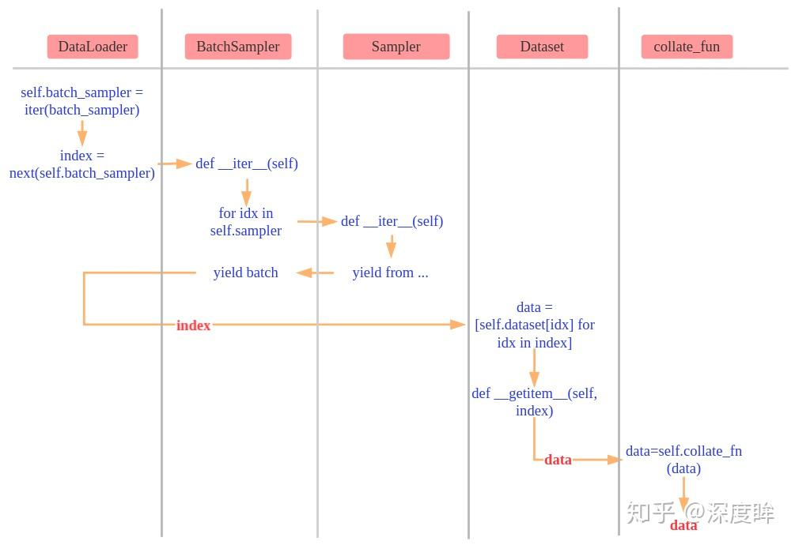

## dataset

dataset可以创建数据集


```
from torch.utils.data import Dataset


class ImageDataset:
    def __init__(self, raw_data):
        self.raw_Data = raw_data
    
    def __len__(self):
        return len(self.raw_Data)
    
    def __getitem__(self, index):
        image, lable = self.raw_Data[index]
        return image, lable


```

## dataloader

dataloader加载、划分数据集

```
dataset = face_dataset # Dataset部分自定义过的face_dataset # 创建Dateset(可以自定义)
    
dataloader = torch.utils.data.DataLoader(dataset,batch_size=64,shuffle=False,num_workers=8)  # Dataset传递给DataLoader

for i in range(epoch):
    for index,(img,label) in enumerate(dataloader):    # DataLoader迭代产生训练数据提供给模型
        ........
```

关于dataloader的参数：

```
DataLoader(dataset, batch_size=1, shuffle=False, sampler=None,
           batch_sampler=None, num_workers=0, collate_fn=None,
           pin_memory=False, drop_last=False, timeout=0,
           worker_init_fn=None)
```

- num_workers (python:int, optional): 多少个子程序同时工作来获取数据，多线程。 (default: 0)

- collate_fn (callable, optional): 合并样本列表以形成小批量。

- pin_memory (bool, optional): 如果为True，数据加载器在返回前将张量复制到CUDA固定内存中。

- drop_last (bool, optional): 如果数据集大小不能被batch_size整除，设置为True可删除最后一个不完整的批处理。如果设为False并且数据集的大小不能被batch_size整除，则最后一个batch将更小。(default: False) 

- timeout (numeric, optional): 如果是正数，表明等待从worker进程中收集一个batch等待的时间，若超出设定的时间还没有收集到，那就不收集这个内容了。(default: 0) 

- worker_init_fn (callable, optional*):每个worker初始化函数 (default: None)

## dataloader的原理

本质上，dataloader做的最重要的事情是：**将不能迭代的数据变成可迭代的。**

第二重要的事情是**多分了一个维度（batch）**

其他的功能都是顺带操作。

    

### 1. `self.batch_sampler = iter(batch_sampler)`  
这一步是 `DataLoader` 在初始化时生成 `BatchSampler` 的迭代器。  
- **`batch_sampler`** 是一个组合采样器和批次处理器的对象，`iter(batch_sampler)` 将 `batch_sampler` 转换为迭代器。  
- 迭代器是用于批量生成数据索引的，生成的每个元素是一个包含多个索引的批次，这些索引用于从数据集中取出相应的数据。

### 2. `index = next(self.batch_sampler)`
在每次迭代时，`DataLoader` 会通过 `next(self.batch_sampler)` 从 `BatchSampler` 的迭代器中获取下一个批次的索引。  
- **`next()`** 函数用于从迭代器中获取下一个元素，在这里，返回的是一组（`batch_size` 个）数据索引。
- 这一步实际上会调用 `BatchSampler` 的 `__iter__` 方法，具体实现如下：

### 3. `BatchSampler` 的 `__iter__` 方法依赖于 `Sampler` 对象  
`BatchSampler` 并不会直接生成索引，而是依赖内部的 `Sampler` 对象。  
- **`Sampler`** 是一个生成单个样本索引的迭代器，`BatchSampler` 调用 `Sampler` 的 `__iter__` 方法，逐个生成数据集的索引。  
- 当采样到 `batch_size` 个索引后，`BatchSampler` 将这些索引打包成一个批次，返回给 `DataLoader`。

### 4. `data = [self.dataset[idx] for idx in index]`  
有了一个批次的索引（即 `batch_size` 个索引），`DataLoader` 开始从 `Dataset` 中获取对应的数据。  
- `DataLoader` 调用 `Dataset` 的 `__getitem__` 方法获取数据。对于每个索引 `idx`，它从 `Dataset` 中提取出一个数据对象，形成一个列表 `data`，其中包含 `batch_size` 个数据对象。

### 5. `data = self.collate_fn(data)`
接下来，将这 `batch_size` 个数据对象通过 `collate_fn` 函数进行聚合。  
- **`collate_fn`** 的作用是将数据打包成批次，在第 0 维度（批次维度）进行聚合。例如，原来的数据是多个单个对象，通过 `collate_fn` 后，会得到一个 `(batch_size, ...)` 的数据结构，方便后续处理。
- PyTorch 默认的 `collate_fn` 是 `default_collate`，它可以处理各种类型的输入数据（如张量、列表等），将其聚合为一个批次。

### 6. 不断重复步骤 1-5
- `DataLoader` 会不断重复上述步骤，从 `Sampler` 中采样索引，经过 `BatchSampler` 形成批次索引，然后从 `Dataset` 中获取数据，最后通过 `collate_fn` 聚合数据，形成一个个批次的最终输出。

### 总结
- **`self.batch_sampler = iter(batch_sampler)`**：`DataLoader` 初始化时生成 `BatchSampler` 的迭代器。
- **`next(self.batch_sampler)`**：获取一个批次的索引。
- **`BatchSampler` 的 `__iter__` 方法依赖 `Sampler`**：通过 `Sampler` 采样并组合成批次索引。
- **`self.dataset[idx]`**：利用索引从数据集中获取数据。
- **`self.collate_fn(data)`**：将批次数据聚合成 `(batch_size, ...)` 的数据结构。

通过上述过程，`DataLoader` 每次可以返回一个批次的数据，并在训练过程中不断生成下一个批次。
